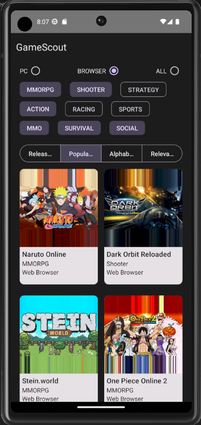

### Test Case For Famobi

1. Clone the repository
2. run `npm install` to install all dependencies
3. run `npx react-native start` to start the metro bundler for React Native
4. run `npx react-native run-android` to start the emulator(or physical device via USB) and the application

If you don't have AVD(Android Virtual Device) easiest way to create is Android Studio > Device Managers > Create AVD

If you received an error about there is no Metro Package Bundler running on 8081;

Check if the reverse tcp is setted by using `adb reverse tcp:8081 tcp:8081`
You can always check which ports are reversed by using `adb reverse --list`

Here is a sample view of the application:

Solution for extra problem is in "./extra_problem/solution.ts"
The solution is printed in the App component to the console screen where Metro bundler is running
